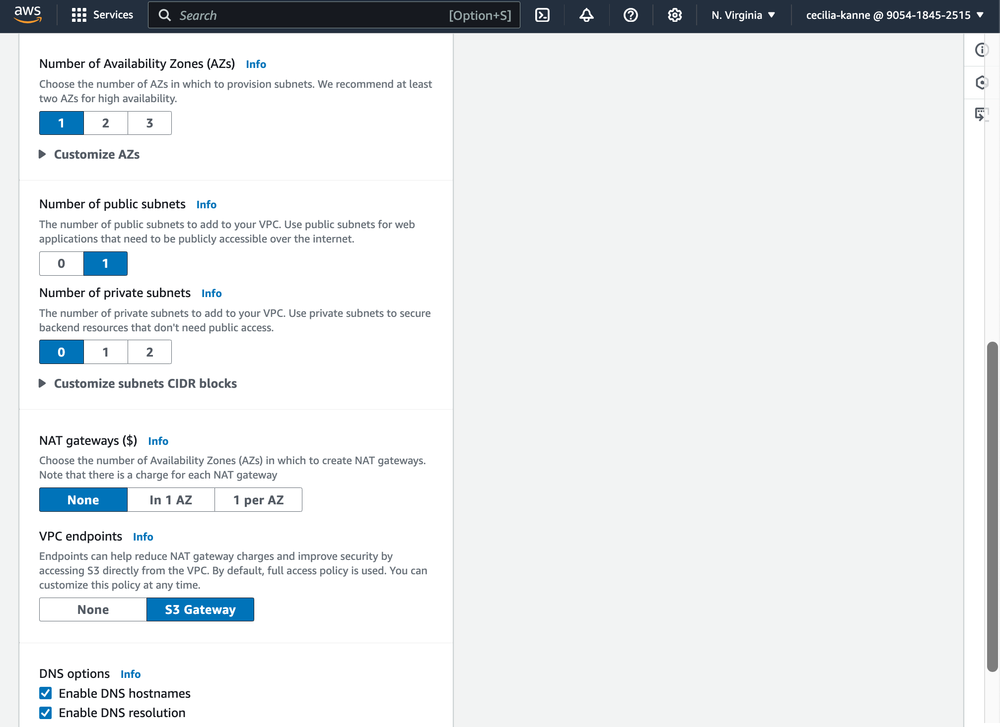
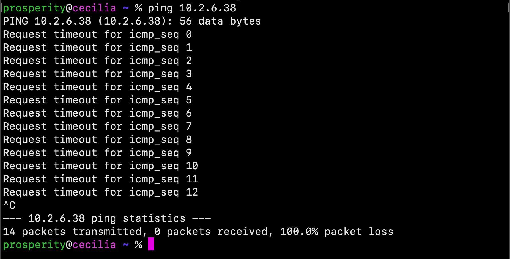

**_VPC Monitoring with Flow Logs_**
------------------------------------------------------------
### Overview

Hello and welcome! My name is Cecilia, and in this amazing project, I will demonstrate how to monitor a VPC with Flow Logs. Monitoring VPC traffic is essential for understanding network activity, identifying potential security threats, and optimizing infrastructure.

**Why Monitor VPC Traffic?**
Monitoring VPC traffic offers several key advantages:

- _Enhanced Network Visibility_: Gain a detailed view of incoming and outgoing traffic at the subnet, network interface, or VPC level.
- _Proactive Threat Detection_: Identify unusual traffic patterns or unauthorized access attempts to mitigate potential security risks.
- _Optimized Infrastructure_: Understand traffic flow to fine-tune application architecture and improve performance.


Let's dive in and explore how to make VPC monitoring seamless, insightful, and effective!

--------------------------------------------------------------------------
### Create Two VPCs from Scratch

#### Log in to your AWS Account
1. Navigate to the **VPC Console** by searching for "VPC" in the top search bar.
2. From the left-hand navigation bar, select **Your VPCs**.
3. Click **Create VPC**.
4. Select **VPC and more**.

---

#### Create VPC 1
1. Under **Name tag auto-generation**, enter `NextWork-1`.

2. Change the **IPv4 CIDR block** from `10.0.0.0/16` to `10.1.0.0/16`.
   - 💡 **Why are we updating the CIDR block?**  
     This ensures each VPC has a unique and easily memorable range. For example:
     - VPC 1: `10.1.0.0/16`
     - VPC 2: `10.2.0.0/16`

3. Leave the **IPv6 CIDR block** as `No IPv6 CIDR block`.

4. Set **Tenancy** to `Default`.


5. Select **1 Availability Zone (AZ)**.

6. Choose **1 public subnet** and **0 private subnets**.

7. For **NAT gateways, select `None`.



8. For **VPC endpoints**, select `None`.

9. Leave **DNS options** checked.

10. Click **Create VPC**.

---

#### Create VPC 2
1. Repeat the steps for VPC 1 but with the following changes:
   - Name: `NextWork-2`
   - IPv4 CIDR block: `10.2.0.0/16`
   - 💡 **Why unique CIDR blocks?**  
     Prevent overlapping IPs, which can cause routing conflicts and connectivity issues.


2. After creation, click **View VPC** and navigate to the **Resource map** tab to review the setup.


---

##### Launch an Instance in VPC 1
1. Navigate to the **EC2 Console** by searching for "EC2" in the top search bar.
2. Select **Instances** from the left navigation bar and click **Launch instances**.
3. Configure the instance:
   - Name: `Instance - NextWork VPC 1`
   - **AMI**: Amazon Linux 2023
   - **Instance Type**: `t2.micro`
   - **Key Pair**: Select `Proceed without a key pair (not recommended)`.
     - 💡 AWS manages key pairs with EC2 Instance Connect, so manual setup isn’t necessary.
   - **Network Settings**:
     - **VPC**: `NextWork-vpc-1`
     - **Subnet**: Public subnet of VPC 1
     - Enable **Auto-assign public IP**.
     - 💡 **Why enable public IP?**  
       Required for EC2 Instance Connect to access the instance.


4. **Firewall (Security Group)**:
   - Create a new security group: `NextWork-1-SG`.
   - Add a rule:
     - Type: `All ICMP - IPv4`
     - Source: `0.0.0.0/0`
     - 💡 **Why allow ICMP traffic?**  
       To enable ping tests, which require ICMP traffic to be open.
5. Click **Launch instance**.


#### Launch an Instance in VPC 2
1. Follow the same steps as VPC 1, but ensure:
   - Name: `Instance - NextWork VPC 2`
   - VPC: `NextWork-vpc-2`
   - Security group: `NextWork-2-SG`
   - Allow ICMP traffic.


---

#### Set Up Flow Logs
1. Navigate to the **CloudWatch Console**.
2. Verify your region matches the one where your VPCs were created.
   - 💡 **Why match regions?**  
     CloudWatch data is region-specific.
3. In the left navigation, go to **Log Groups** and click **Create log group**.
4. Enter `NextWorkVPCFlowLogsGroup` as the log group name and click **Create**.


#### VPC Flow Logs Setup

Wow, there were some interesting settings we skipped! What were they about?
- **Retention setting** is *Never expire* by default, which means your logs won’t be deleted over time. They’ll stick around as long as you need them, unless you decide to clear them out yourself.
- **Log class** is *Standard* by default, which means the logs that get created will get accessed or analyzed regularly. If we chose *Infrequent Access* instead, your logs will be stored for long-term archiving.

- Head back to your **VPC console**.
- Select the **Your VPCs** page.
- Select `NextWork-1-vpc`.
- Scroll down to the **Flow Logs** tab and click on **Create flow log**.


#### Flow Log Settings

- Enter `NextWorkVPCFlowLog` in the **Name** field.
- Set **Filter** to *All*.
- Set the **Maximum aggregation interval** to 1 minute.
- Leave **Destination** as *Send to CloudWatch Logs*.
- Set **Destination log group** as `NextWorkVPCFlowLogsGroup`.


#### Setting Up IAM Role for Flow Logs

Under the **IAM role**, you might notice that there isn't an IAM role designed for Flow Logs yet. Let's set one up!

In the navigation pane, choose **Policies**.
- Choose **Create policy**.
- Choose **JSON**.
- Delete everything in the **Policy editor**.
- Add this JSON policy to the empty Policy editor:

```json
{
   "Version": "2012-10-17",
   "Statement": [
     {
       "Effect": "Allow",
       "Action": [
         "logs:CreateLogGroup",
         "logs:CreateLogStream",
         "logs:PutLogEvents",
         "logs:DescribeLogGroups",
         "logs:DescribeLogStreams"
       ],
       "Resource": "*"
     }
   ]
}
```

-  Choose **Next**.
-  For your policy's name, call it `NextWorkVPCFlowLogsPolicy`.
-  Choose **Create policy**.  


#### Create IAM Role
- In the left-hand navigation pane, choose **Roles**.
- Choose **Create role**.
- For **Trusted entity type**, choose **Custom trust policy**.


#### Custom Trust Policy Configuration
Replace `"Principal": {}` with the following:

```json
"Principal": {
   "Service": "vpc-flow-logs.amazonaws.com"
}
```
- Choose `Next`.


- On the **Add permissions** page, search for the policy you’ve created – `NextWorkVPCFlowLogsPolicy`.
- Select your policy.
- Choose `Next`.
- Enter a name for your role – `NextWorkVPCFlowLogsRole`.
- Choose `Create role`.


#### Head back to your VPC console's Create Flow Log Page
- Select the refresh button next to the IAM role field.
- Select your IAM role – `NextWorkVPCFlowLogsRole`.
- Click on **Create flow log**.


Nice – the flow log is all set up! This means network traffic going into and out of your VPC is now getting tracked 🔥.

#### Test VPC Peering
Phew, the flow log setup is done! Let's generate some network traffic and see whether our flow logs can pick up on them. We're going to generate network traffic by trying to get our instance in VPC 1 to send a message to our instance in VPC 2. Since we're trying to get our instances to talk to each other, this also means we're testing our VPC peering setup at the same time!

Now let's get `Instance 1` to send test messages to `Instance 2`
- Head to your **EC2** console and the **Instances** page.
- Select the checkbox next to Instance – `NextWork VPC 1`.
- Select **Connect**.


- In the **EC2 Instance Connect** setup page, select **Connect** again.


- Leave open the **EC2 Instance Connect** tab, but head back to your **EC2** console in a new tab. Select Instance – `NextWork VPC 2`. Copy Instance – `NextWork VPC 2`'s Private IPv4 address.


#### 💡 Why do we pick the Private IPv4 address? 
We’re testing the peering connection between our EC2 instances. If the peering connection is successful, our instances can communicate using each other’s private IPv4 addresses. Using public IPv4 addresses wouldn't provide information about whether the peering connection was successful.

- Switch back to the **EC2 Instance Connect** tab. Run the following command in the terminal:

```bash
ping [Private IPv4 address you just copied]
```
Your final result should look similar to something like:


Uh oh, there is no response. Let's try testing the connection from VPC 1 to VPC 2’s public IP address.

- Head back to your EC2 console and copy the Public IPv4 address of Instance – NextWork VPC 2.


- Head back to your EC2 Instance Connect tab and run the following ping test with this public IPv4 address:

```sh
ping [Public IPv4 address]
```


- Open your computer’s local Terminal. Search for Windows Terminal if you’re using Windows, or Terminal if you’re using a Mac.
- Try running the same ping command for VPC 2’s public IP address from your local terminal. Do you get ping replies back?


**💡 I do get ping replies! What does this mean?**
Nice work getting replies! This is further validation that Instance 2 is reachable from ICMP traffic. It also shows how vulnerable your EC2 instance is to external access when you allow all IP addresses to reach it.

⏸️ Pause and have a think
We receive ping replies when using Instance 2’s public IP address, confirming that VPC 2’s security groups and NACLs are letting in ICMP traffic. However, using Instance 2’s private IP address doesn’t give us any ping replies.

Let's resolve this connectivity issue.

1. Leave open the **EC2 Instance Connect** tab, but head back to your **VPC** console in a new tab.
2. In the **VPC console**, select the **Subnets** page.
3. Select VPC 1's subnet (e.g., `NextWork-1-subnet-public1-...`).
4. Investigate the **Route tables** and **Network ACL** tabs for your subnet.


The network ACL allows all types of inbound traffic from anywhere, so it looks fine. Let’s take a closer look at the route tables… Aha! Mystery solved!

The purpose of a peering connection is to create a direct link between two resources so they can communicate with their private IP addresses. Although `Instance 1` and `Instance 2` are currently connected through the route with a destination of 0.0.0.0/0, but that traffic is through the internet gateway (i.e., traffic will travel through and be exposed to the public internet). To make sure communication between `Instances 1 and 2 is direct, we need to set up a _new_ route that directs traffic to our peering connection (instead of the public internet).


#### Create a Peering Connection and Configure Route Tables
- Head to the **VPC console**, click on **Peering connections** on the left-hand navigation panel.  

- Click on **Create peering connection** in the right-hand corner.  

- Name your Peering connection name as `VPC 1 <> VPC 2`. Select `NextWork-1-VPC` for your VPC ID (Requester).  
- Under **Select another VPC to peer with**, make sure **My Account** is selected.  
- For **Region**, select **This Region**. For **VPC ID (Accepter)**, select `NextWork-2-VPC`.  


💡 **What does Accepter mean?**  
In VPC peering, the Accepter is the VPC that receives a peering connection request! The Accepter can either accept or decline the invitation. This means the peering connection isn't actually made until the other VPC also agrees to it!  

- Click on **Create peering connection**. Your newly created peering connection isn't finished yet! The green success bar says the peering connection has been requested.  

- On the next screen, select **Actions** and then select **Accept request**.


- Click on **Accept request** again on the pop-up panel.  


- Click on **Modify my route tables now** on the top right corner. A peering connection is all set now (nice work!) ✅


#### Update VPC 1's route table
- Select the checkbox next to VPC 1's route table i.e. called `NextWork-1-rtb-public`.
- Scroll down and click on the **Routes** tab.
- Click **Edit routes**.
- Let's add a new route!


💡 **Why do I need to add a new route?**  
Even if your peering connection has been accepted, traffic in VPC 1 won't know how to get to resources in VPC 2 without a route in your route table! You need to set up a route that directs traffic bound for VPC 2 to the peering connection you've set up.

- Add a new route to VPC 2 by entering the CIDR block `10.2.0.0/16` as our Destination.  
- Under Target, select **Peering Connection**.  
- Select `VPC 1 <> VPC 2`.  
- Click **Save changes**.  
- Confirm that the new route appears in VPC 1's **Routes** tab!


### Update VPC 2's route table
Set up the equivalent route in VPC 2's route table. Repeat the same instructions above, but make sure:
- The route table you're updating is `NextWork-2-rtb-public`.
- The Destination is the CIDR block `10.1.0.0/16`.  
- Save your changes! Revisit the **EC2 Instance Connect** tab that's connected to NextWork Public Server...


**CGreat job!!!**  
You've successfully resolved the connectivity issue by setting up a peering architecture between VPC 1 and VPC 2!  

You can validate this by trying to run the same ping command from your local terminal.




**Perfect!** This is validation that our peering connection is truly only letting `Instance 1` get direct access to Instance 2 through private addresses.  

Another optional extension! Back in your EC2 Instance Connect tab, run the same ping command but add `-c 5` to the end of the command.


Ooo nice! The ping test automatically finishes after 5 packets have been sent.

#### Analyze Flow Logs
To wrap things up, let's check out what VPC Flow Logs has recorded about your network's activity!  

- Head to your **CloudWatch console**.  
- Select **Log groups** from the left-hand navigation panel.  
- Click into `NextWorkVPCFlowLogsGroup`.  


- Click into your log stream to see flow logs from EC2 `Instance 1`!


**What is this flow log saying?**  

The snippet below are **VPC Flow Logs** from **AWS CloudWatch**, which record network traffic to and from an Elastic Network Interface (ENI). Below is an analysis of the log details:


In the first log entry, traffic from IP `162.216.150.153` to `10.1.5.194` was **blocked** likely due to the configured security group or network ACL rules.

In the second log entry, SSH traffic (`port 22`) from IP `18.206.107.28` to `10.1.5.194` was **allowed**, likely because the security settings allowed it.


---

#### Using Logs Insights to Analyze Traffic

- In the left-hand navigation panel, click on **Logs Insights**.

- **Select the Log Group**: choose **NextWorkVPCFlowLogsGroup** from the **Select log group(s)** dropdown.
   
- **Select Queries Folder**: Click on the **Queries** folder on the right-hand side.

- Under **Flow Logs**, select **Top 10 byte transfers by source and destination IP addresses**.

- Click **Apply**, then **Run query**.
- Review the query results... Wow!

💡 **What are these results telling me?**  
The query results show the top 10 pairs of source and destination IP addresses that transferred the most data. This is great for investigating heavy traffic flows or unusual data transfers.

- The **bar chart** at the top visualizes how many logs were captured at specific times of the day.
- The **table** below shows the actual results of your query.


-----

#### Conclusion

Congratulations on completing the project with me and successfully managing your AWS resources! By following these steps to delete your resources, you’ve not only learned how to monitor and analyze network traffic in a VPC, but also gained valuable experience in resource management. Properly cleaning up your resources ensures that you avoid unnecessary costs and maintain a well-organized cloud environment. Remember, the skills you've developed here—working with EC2 instances, VPC peering, CloudWatch, and IAM roles—are crucial in real-world cloud architecture and management. Keep practicing, and you'll continue to strengthen your cloud expertise. Well done! 🙌

I hope you enjoyed it! For more details on similar projects and more, please visit my GitHub portfolio: https://github.com/ceciliacloud


------

#### Acknowledgements:
_This project was made possible by **NextWork**_